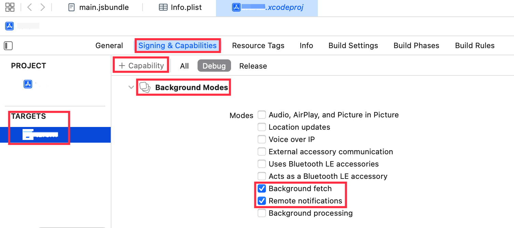

# [Solved] Xcode: add "fetch" to the list of your supported UIBackgroundModes in your Info.plist

## 错误信息

```bash
xx[123:345] You've implemented -[<UIApplicationDelegate> application:performFetchWithCompletionHandler:], but you still need to add "fetch" to the list of your supported UIBackgroundModes in your Info.plist.
xx[123:345] You've implemented -[<UIApplicationDelegate> application:didReceiveRemoteNotification:fetchCompletionHandler:], but you still need to add "remote-notification" to the list of your supported UIBackgroundModes in your Info.plist.
```

## 解决

TARGETS -> Singing & Capabilities -> `+ Capabilities` -> Find Background Modes, 勾选 Background fetch 后台获取，Remote notifications 远程推送通知。



Xcode 的东西必须碰一次记一次。